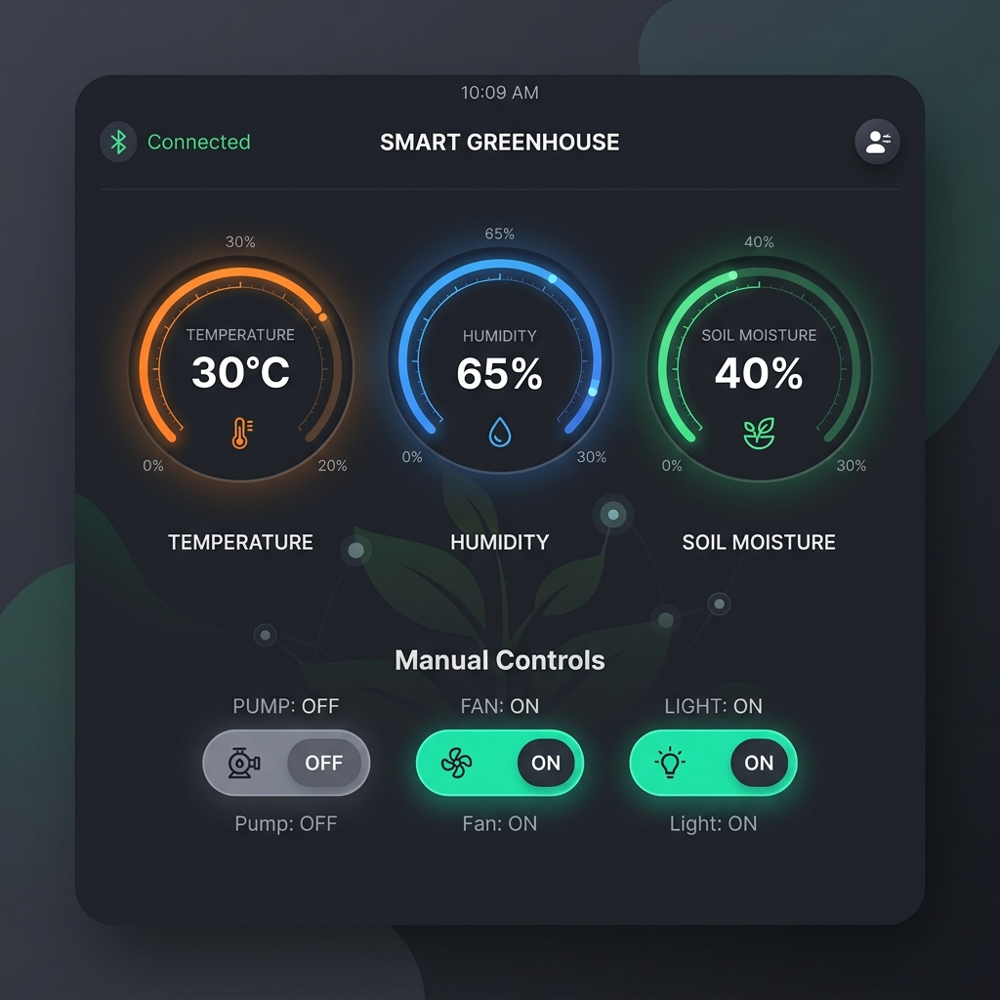
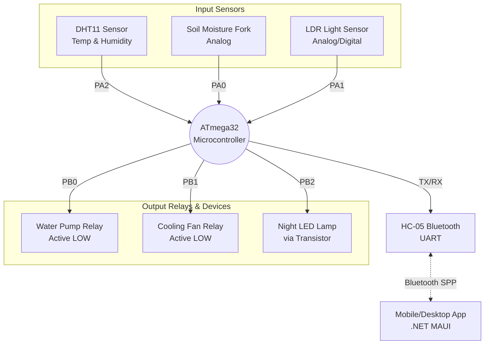

# 🌿 Smart Greenhouse Project — مشروع الصوبة الزراعية الذكية

  

## 📌 نبذة عن المشروع (Abstract)
هذا المشروع عبارة عن نظام متكامل لإدارة صوبة زراعية ذكية (Smart Greenhouse). يتكون من جزأين رئيسيين:
1. **الهاردوير (ATmega32):** يقوم بقراءة بيانات البيئة المحيطة بالنبات (درجة الحرارة، نسبة الرطوبة الجوية، رطوبة التربة، والإضاءة) باستخدام حساسات (DHT11, Soil Moisture, LDR). ثم يتخذ قرارات تلقائية (تشغيل المضخة، المروحة، أو الإضاءة) بناءً على هذه القراءات لحماية النبات.
2. **برنامج الموبايل والكمبيوتر (MAUI App):** يتصل بالميكروكنترولر عبر البلوتوث (HC-05) لعرض القراءات بشكل حي ومباشر على شاشة جذابة. كما يوفر إمكانية التحكم اليدوي (Manual Override) في الأجهزة لتدخل المستخدم في أي وقت.

### 📱 واجهة التطبيق (App Interface)

---

## 📐 رسم هيكلي للمشروع (Block Diagram)

---

## 🔌 التوصيلات الكهربائية وبروتوس (Proteus Wiring)

### 1. إعدادات الميكروكنترولر:
- **الميكروكنترولر:** `ATmega32` يعمل بتردد داخلي `8MHz`.
- في البروتوس، قم بتعديل إعدادات الـ ATmega32 وضع (CKSEL Fuses) على `Internal RC Oscillator 8MHz`.

### 2. الحساسات (المداخل - Inputs):
- **حساس رطوبة التربة:** يتصل بطرف `PA0` (ADC Channel 0). 
- **حساس الضوء (LDR):** يتصل بطرف `PA1` مع مقاومة سحب لأسفل (Pull-down 10kΩ). الإشارة الرقمية للظلام = `HIGH`.
- **حساس الحرارة والرطوبة (DHT11):** يتصل بطرف `PA2` مع مقاومة رفع (Pull-up 4.7kΩ) لضمان بروتوكول الاتصال (One-Wire).

### 3. المشغلات (المخارج - Outputs):
- **ريلاي المضخة (Pump):** يتصل بطرف `PB0`. (الريلاي من نوع Active LOW، يعمل عند 0V).
- **ريلاي المروحة (Fan):** يتصل بطرف `PB1`. (الريلاي من نوع Active LOW، يعمل عند 0V).
- **الإضاءة (LED):** تتصل بطرف `PB2` عبر ترانزستور (مثال: `BC547`) كمفتاح (Switch) لتوفير تيار كافٍ لليدات. الـ Base متصلة بمقاومة `4.7kΩ` من الميكروكنترولر.

### 4. وحدة الاتصال (Bluetooth HC-05):
- يتم توصيل طرف `RXD` للموديول بطرف `TXD (PD1)` في الـ ATmega32.
- يتم توصيل طرف `TXD` للموديول بطرف `RXD (PD0)` في الـ ATmega32.

---

## ❓ أسئلة المناقشة المتوقعة لإدارة الهاردوير (C & ATmega32)

### س1: لماذا تم بناء الكود باستخدام `State Machine` بدلًا من كتابته كله في الـ `main`؟
**الإجابة:** 
لأن الـ State Machine تمنع تعليق النظام (Non-blocking). النظام يمر بحالات متسلسلة: (قراءة الحساسات ← تقييم القراءات ← تنفيذ القرار بالتشغيل/الإيقاف ← إرسال الداتا بالبلوتوث). هذا التصميم يسهل اكتشاف الأخطاء ويضمن أن الجهاز مستجيب دائمًا لأوامر البلوتوث ولا يتوقف عند انتظار حساس معين.

### س2: لماذا لم تستخدم الدالة `_delay_ms()` في الـ Main Loop؟
**الإجابة:** 
استخدام `delay` يوقف المعالج تمامًا، مما يعني أنه لن يستطيع استقبال أوامر البلوتوث لغلق المضخة مثلاً أثناء فترة الانتظار. بدلاً من ذلك، قمنا باستخدام المؤقت (`Timer0`) لحساب الزمن وتحديث القراءات كل 1.5 ثانية (1500 مللي ثانية) بشكل متزامن.

### س3: كيف قمت بتنفيذ خاصية الـ (Hysteresis) في المروحة والمضخة، ولماذا؟
**الإجابة:**
الـ Hysteresis هي وضع عتبتين (Thresholds) مختلفتين للتشغيل والإيقاف بدلًا من رقم واحد.
مثال المروحة: تعمل عند `30°C` وتغلق عند `27°C`. 
**السبب:** لمنع الريلاي من الارتعاش (Chattering) وتشغيل وإيقاف المروحة بسرعة مدمرة إذا تذبذبت درجة الحرارة حول `30°C` (مثلًا 29.9 ثم 30.1 وهكذا).

### س4: كيف تم التعامل مع حساس التربة ليقرأ 0% عند الجفاف و 100% في الماء؟
**الإجابة:**
حساس التربة (الشوكة) مقاومته تقل في الماء، مما يعني أن جهد الـ ADC يكون منخفضًا في الماء، ويكون عاليًا جدًا (حوالي 1023) في الجفاف أو عند نزعه. لذا قمنا בעكس المعادلة في الكود `((1023 - raw_adc) * 100) / 1023` ليصبح المنطق صحيحًا (جاف = 0%).

---

## ❓ أسئلة المناقشة المتوقعة للبرنامج وتطبيق الموبايل (MAUI App)

### س1: ما هي بنية `MVVM` التي قمت باستخدامها في التطبيق؟ ولماذا؟
**الإجابة:**
هي اختصار لـ (Model - View - ViewModel).
- **Model:** هو كلاس البيانات `SensorData.cs`.
- **View:** هي واجهة المستخدم `DashboardPage.xaml`.
- **ViewModel:** هو العقل المدبر `DashboardViewModel.cs`.
**السبب:** هذا النمط يفصل واجهة المستخدم (التصميم) عن منطق الكود (Logic)، مما يسهل صيانة الكود وربط المتغيرات (Data Binding) بحيث تتحدث الشاشة تلقائيًا بمجرد وصول بيانات جديدة من البلوتوث دون الحاجة لتحديث كل عنصر برمجيًا.

### س2: كيف تمكّن التطبيق من قراءة بيانات البلوتوث دون أن "يتجمد" (Freezing)؟
**الإجابة:**
قراءة البلوتوث تتم في مسار عمل خلفي منفصل (Background Task/Thread) عبر `Task.Run` وحلقة (While loop) مستمرة. عندما تصل البيانات، يتم تمريرها إلى ملف `DataParser.cs` لتحليلها، ثم تُرسل الواجهة عبر دالة `MainThread.BeginInvokeOnMainThread` لتحديث الـ UI بأمان تام دون تجميد الشاشة.

### س3: ماذا يحدث إذا انقطع سيل البيانات (Data stream) وتداخلت السطور القادمة من البلوتوث؟
**الإجابة:**
تم تصميم محلل البيانات `DataParser` باستخدام "مخزن مؤقت" (StringBuilder Buffer). الكود يجمع الحروف (Bytes) القادمة تباعًا ولا يقوم بتحليلها إلا عندما يستقبل علامة السطر الجديد `\n`. وإذا كان السطر غير مكتمل، يتركه في المخزن حتى يكتمل مع الدفعة القادمة، مما يمنع الأخطاء البرمجية الناتجة عن البيانات المبتورة.

### س4: كيف نفذت التحكم اليدوي من الهاتف (Manual Override) متجاهلاً الحساسات؟
**الإجابة:**
عندما يضغط المستخدم على زر المضخة، يرسل التطبيق أمرًا نصيًا عبر البلوتوث مثل `P:ON`.
في الـ ATmega32، توجد دالة لمعالجة النصوص (`Greenhouse_ProcessCommand`). عند قراءة هذا الأمر، يتم تغيير حالة المتغير `g_pump_mode` من الوضع التلقائي `MODE_AUTO` إلى الوضع اليدوي `MODE_MANUAL_ON`. في هذه الحالة، يتجاهل الميكروكنترولر قراءة حساس التربة تمامًا ويشغل المضخة فورًا حتى نرسل له أمر الرجوع للتلقائي `A:AUTO`.

---
*تم إعداد هذا الملف لتغطية أهم جوانب المشروع البرمجية والإلكترونية.* 🌿🚀
